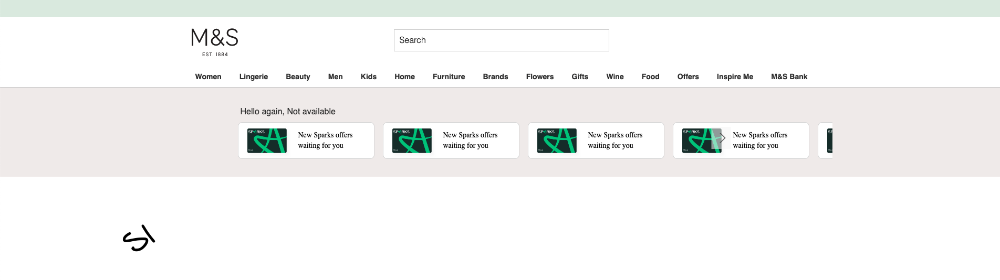
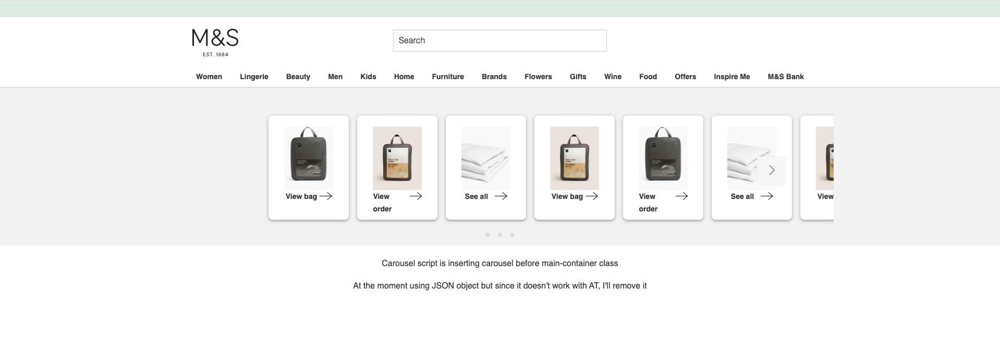

# Carousel-exp237


### dashboard that can carousel multiple cards


#### Exp-237 Carousel

Made out of  2 or possibly 3 depending on what works out to be more of a user friendly approach.    
One experiment to be a container for cards.    
The other experiment to pass the cards.    
Offers are out.         
Separation of UI/ data - third party passing data. 

ATM it passes data to Carousel injected from console via a self exec function/ slides object.
Another does it all together

----

- Targets these page(s):  DLP, PLP, PDP
- About experiment:

   - Scrolls sideways, touch/drag under `1025px`, over it shows `left/right` arrows

   - Shows right arrow, margin-left - check dots some of these things are linked to last one myb not needed hr 

   - Needs to be a container for the homepage dashboard that can hold multiple cards - each card needs to have it's own rules/logic.

   - No cards carousel container shown - Greeting  and username signed-in

   - Card X close to remove individual messages - if all messages have been removed by a user, then dashboard should disappear  (checkout what messages these are)


- Assets:
   • Link to [fonts](https://marksandspencer.invisionapp.com/console/Dashboard-ckniwy5k402qu010l4zea617m/ckniwy7b602qy010lfhcrf0wj/inspect).
   • Link to [design](https://marksandspencer.invisionapp.com/console/Dashboard-ckniwy5k402qu010l4zea617m/ckniwy7b602qy010lfhcrf0wj/inspect).


<br /><br />

<kbd>Screenshot 1</kbd>


<br />

<kbd>Old design</kbd>



> user no card,  x to close to qa

```
   mboxCreate("cardsOffers", "profile.keyword=Carousel Offers")

   HTML Offer code: Get your ${profile.keyword} here!

   User sees: =>  Get your Carousel Offers here


```


