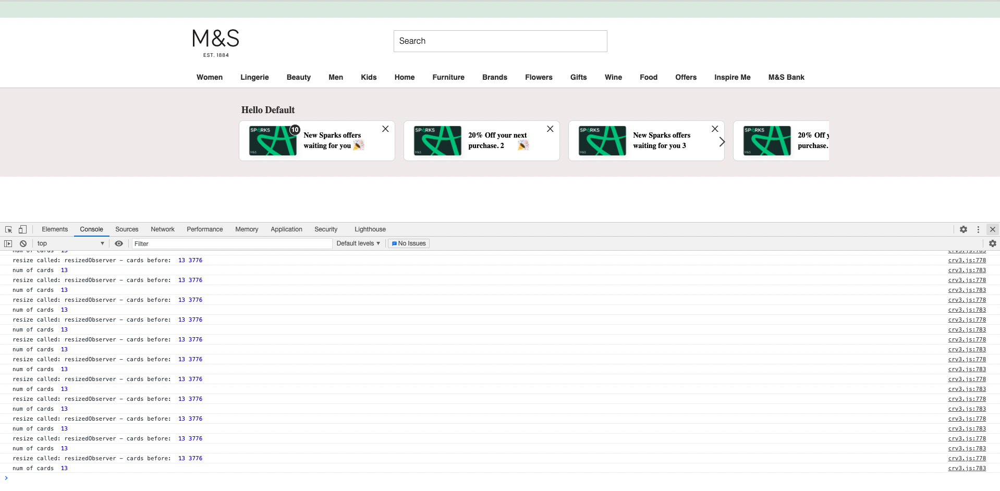

# Carousel-exp237

Dashboard that can carousel multiple cards

# Exp-237 Carousel

Made out of  **2 separate** Adobe Target Activities. One activity it's set-out to be the **cards container**, while the other **passes the cards** to the container.  

It passes any number of cards, css classes to override existing styles, images, heading, footer and emoji using a Javascript Object.     
It also fetches user's Spark cards while user is logged in, and adds number of total Offers to first card in carousel, but it can also be added to any other card in carousel. 

## How-to-implement

- Copy/paste `carouselRegularv4.js` using dev tools console to bring up an carousel's empty container
- Copy/paste `carouselDatav3.js` using dev tools console to add-on the carousel's cards 


## About experiment

### Targets these page(s):  

DLP, PLP, PDP

### Functionality

- Scrolls sideways over 1025px, touch/drag event under 1025px
- X removes card from carousel
- When no cards are left, container is removed
- No arrows if number of cards width less than viewport width
- No arrows under 1025px
- Animation:        
    •  Page load: it drops each card in sequence one after another       
    •  Scroll left/right: upon reaching the end, card bounces (both scroll and touch events)

-`Drag/touch` and `snap` to edges in **mobile**
-`Last/First` cards in a row **bounces** as it reaches **viewport's edge**


- Assets:
   • Link to [fonts](https://marksandspencer.invisionapp.com/console/Dashboard-ckniwy5k402qu010l4zea617m/ckniwy7b602qy010lfhcrf0wj/inspect).
   • Link to [design](https://marksandspencer.invisionapp.com/console/Dashboard-ckniwy5k402qu010l4zea617m/ckniwy7b602qy010lfhcrf0wj/inspect).


<br /><br />

:seedling:  [live demo](https://donpio.tech/repositories/mtest/updatecar.html)

<br/>

<kbd>Screenshot 1</kbd>


<br />
<br/>

//
 


# AT Mbox (Global/Regular) Admin Panel

> These also can be managed/ combined to work together with mParticle and Akami or Tealium
 and produce accurate reporting data/impressions across activities and avoid false reporting  in cases in which they do overlap.

- name used to refer to the single server call made at the top of each web page in AT

- by default name `target-global-mbox`

- regular mbox typically wraps around content  with a <div> tag

- global mbox is 'empty' and does not wrap around any content

- regular mbox content from only one activity

- content from multiple activities can be delivered in one response to a global mbox


## Passing params

- `targetPageParams` function used to pass parameters to the global mbox in AT

- ex: recommendations activity: params to represent current product or category

- call js fn must come before global mbox on the page

- add params to all mbox in a page with `targetPageParamsAll` fn

- pass arrays, json objects, ampersand-delimited list

- aecloud debugger to verify passing params

- mbox to target/get impressions working that span across multiple pages and locations

- activity impression responses for a particular activity - prevent overlapping regions with
  regional mboxes.

- two activities targeting same selector will not be overlap

- regional mboxes are needed in order to accurately track impressions for overlapping offers
  especially important when u have multiple teams working on a site.


<kbd>sc1</kbd>
```

   // Add class with jQuery
   
   $(“div[data-mbox-id=’homepage-secondary-1′]”).addClass(“mbox-name-homepage-secondary-1”);
   
   
   // Call Target for regional mbox content and apply to the appropriate selector
   
   adobe.target.getOffer({
      “mbox”: “homepage-secondary-1”,
      “success”: function(offer) {
         adobe.target.applyOffer({
            “mbox”: “homepage-secondary-1”,
            “selector”: “div[data-mbox-id=’homepage-secondary-1′]”,
            “offer”: offer
            
         });
      
      },
      
      “error”: function(status, error) {
         console.log(‘Error’, status, error);
         
      }});
      
     


```


###  Call getOffers() for all views  &nbsp;<kbd>sc2</kbd>
```

adobe.target.getOffers({
    request: {
      prefetch: {
        views: [{}]
    }
  }
});


```


### Call getOffers() to retrieve latest views with passed-in parameters and profile params  &nbsp;<kbd>sc3</kbd>

```
   adobe.target.getOffers({
  request: {
    "prefetch": {
      "views": [
        {
          "parameters": {
            "ad": "1"
          },
          "profileParameters": {
            "age": 23
          }
        }
      ]
    }
  }
});

```


### Call getOffers to retrieve mboxes with params and profile params passed-in  &nbsp; <kbd>sc4</kbd>

```
   adobe.target.getOffers({
  request: {
    execute: {
      mboxes: [
        {
          index: 0,
          name: "first-mbox"
        },
        {
          index: 1,
          name: "second-mbox",
          parameters: {
            a: 1
          },
          profileParameters: {
            b: 2
          }
        }
      ]
    }
  }
});


```


### Call getOffers() to perform a pageLoad &nbsp; <kbd>sc5</kbd>

```
   adobe.target.getOffers({
    request: {
        execute: {
            pageLoad: {
                parameters: {}
            }
        }
    }
});


```


